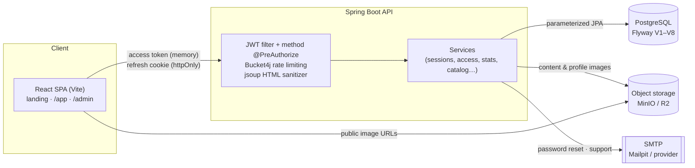

# VetSpace

QCM (multiple-choice) study platform for veterinary students — French UI.
Students filter a question bank into practice/exam sessions, answer
proposition-by-proposition with server-side scoring, review commented
corrections and MindMaps, and track progress. Access is gated by
subscriptions activated from one-time codes. Admins/teachers manage the
catalog, questions, packs & codes, subscribers, and moderation.

- **`/backend`** — Spring Boot 3.5 · Java 21 · Maven · PostgreSQL · Flyway
- **`/frontend`** — React 18 · Vite · TypeScript · Tailwind CSS
- **`/e2e`** — Playwright smoke test against the seeded stack

## Architecture



Auth: BCrypt(12) passwords; 15-min access token kept in memory; 7-day refresh
token in an httpOnly Secure cookie, hashed in the DB, rotated on use, with
family revocation on reuse. Rich HTML is sanitized server-side (jsoup) on save
and client-side (DOMPurify) on render.

## Quick start (local dev)

Prereqs: Docker, JDK 21, Node 20.

```bash
cp .env.example .env                                   # 1. set JWT_SECRET, ADMIN_EMAIL, ADMIN_PASSWORD
docker compose up -d                                   # 2. postgres + minio + mailpit
docker run --rm --network host minio/mc sh -c \
  "mc alias set m http://localhost:9000 minioadmin minioadmin && mc mb -p m/vetspace && mc anonymous set download m/vetspace"  # 3. create media bucket
(cd backend && ./mvnw spring-boot:run -Dspring-boot.run.profiles=dev)   # 4. API on :8080 (seeds on first run)
(cd frontend && npm ci)                                # 5. install web deps
(cd frontend && npm run dev)                           # 6. app on http://localhost:3000
```

Open http://localhost:3000. Mailpit UI (sent emails): http://localhost:8025.
MinIO console: http://localhost:9001.

### Test & verify (what CI runs)

```bash
(cd backend && ./mvnw verify)          # integration tests (Testcontainers) + JaCoCo >=70% service gate
(cd frontend && npm run lint && npm test && npm run build)   # eslint + Vitest + type-check/build
bash scripts/e2e.sh                    # Playwright smoke on the seeded e2e stack
```

Dependency scanning runs on its own weekly schedule rather than on every push — see
[`docs/deploy.md`](docs/deploy.md) §14.

## Environment variables

| Variable | Default | Purpose |
|---|---|---|
| `DB_NAME` / `DB_USER` / `DB_PASSWORD` | `vetspace` | PostgreSQL database + credentials |
| `DB_URL` | `jdbc:postgresql://localhost:5432/vetspace` | JDBC URL (override for non-local DB) |
| `JWT_SECRET` | *(none)* | Signs access tokens. No default by design — the `prod` profile refuses to boot without one ≥32 bytes. `openssl rand -base64 48` |
| `FRONTEND_URL` | `http://localhost:3000` | Base URL used to build password-reset links |
| `CORS_ALLOWED_ORIGINS` | `http://localhost:3000,http://127.0.0.1:3000` | Comma-separated CORS allowlist (no wildcard) |
| `MAIL_HOST` / `MAIL_PORT` | `localhost` / `1025` | SMTP server (Mailpit in dev) |
| `MAIL_USERNAME` / `MAIL_PASSWORD` | — | SMTP auth (blank in dev) |
| `MAIL_FROM` | `noreply@vetspace.local` | From address |
| `MAIL_MODE` | `log` | `log` (print, no SMTP) or `smtp` (send) |
| `MEDIA_ENDPOINT` | `http://localhost:9000` | S3/MinIO endpoint |
| `MEDIA_BUCKET` | `vetspace` | Bucket for uploaded images |
| `MEDIA_ACCESS_KEY` / `MEDIA_SECRET_KEY` | `minioadmin` | Object-storage credentials |
| `MEDIA_PUBLIC_BASE_URL` | `http://localhost:9000/vetspace` | Public base URL images are served from |
| `RECAPTCHA_SECRET` | — | Google reCAPTCHA server secret |
| `RECAPTCHA_ENABLED` | `true` | Set `false` to bypass captcha (dev/e2e) |
| `DEMO_QUESTION_LIMIT` | `10` | Max questions in the single demo session for unsubscribed students |
| `SUPPORT_INBOX` | `support@vetspace.local` | Destination for support messages |
| `ADMIN_EMAIL` / `ADMIN_PASSWORD` | — | First-admin bootstrap (dev seeder only) |
| `E2E_SEED_CODE` | — | Deterministic activation code seeded for e2e only — leave empty in real deploys |
| `SEED_ADMIN` | `false` | One-shot first-admin bootstrap; set `true` for a single deploy, then delete |
| `AUTO_VERIFY_EMAILS` | `false` | Dev/e2e only — skips email verification. Rejected by the `prod` profile |
| `RATE_LIMITS_ENABLED` | `true` | Dev/e2e only — `false` disables every rate limiter. Rejected by the `prod` profile |
| `COOKIE_SAME_SITE` / `COOKIE_SECURE` | `Strict` / `true` | Refresh-cookie attributes; prod defaults to `Lax` behind the Vercel proxy |
| `DB_POOL_MAX` / `DB_POOL_MIN` | `10` / `2` | Hikari pool bounds |

Frontend build-time: `VITE_RECAPTCHA_SITE_KEY` (empty disables the widget),
`VITE_API_URL` (empty = same-origin `/api`).

## Creating the first admin

In production, use the one-shot `SEED_ADMIN` bootstrap — see
[`docs/deploy.md`](docs/deploy.md) §5. Locally, the dev seeder does it on an
**empty** database:

1. In `.env`, set `ADMIN_EMAIL` and `ADMIN_PASSWORD`.
2. Start the backend with the `dev` profile against a fresh DB. On first run
   (no users yet) it seeds one school, a sample catalog, and the `ADMIN`
   account; it is a no-op once any user exists.
3. Sign in at `/login`, then open `/admin`.

To promote an admin later without reseeding, update the user's `role` to
`ADMIN` directly in the database.

## Activation-code sales runbook

Access is sold as one-time activation codes, redeemed by students to unlock a
pack (a school × study-year offer, valid until the end of the academic year).

1. **Create the pack** — Admin console → **Packs & Codes** → *+ Pack*: school,
   study year, name, academic year, price (DA), expiry date.
2. **Generate codes** — on the pack row, *Générer codes*: choose the count and
   uses-per-code. The plaintext codes are shown **once** — download the CSV
   immediately (they are stored only as SHA-256 hashes and can never be shown
   again). Heed the red warning.
3. **Sell & distribute** — collect payment out-of-band (CCP / BaridiMob) and
   hand each buyer one code.
4. **Student redeems** — the student registers, then on **Abonnement** enters
   the code. Redemption is atomic (a code sells exactly once even under a race)
   and opens access immediately, until the pack's expiry.
5. **Manage** — the codes table shows each code's status (active / exhausted /
   revoked / expired). *Révoquer* kills an unsold or leaked code. **Abonnés**
   shows subscribers and lets an admin disable/enable an account.

Operational safety: activation codes are never logged (the dev seeder is the
only, profile-gated exception), and redemption failures return one generic
message so codes can't be probed.

## Deployment

Vercel (SPA) + Railway (API + Postgres) + Cloudflare R2 (images), including the
full environment-variable matrix, the first-admin bootstrap and a post-deploy
checklist: [`docs/deploy.md`](docs/deploy.md).

Verify the production artifacts before shipping — this runs the real backend
image on the `prod` profile plus the production bundle, and drives the whole
student journey through them:

```bash
bash scripts/prod-parity.sh
```

## API & schema docs

- REST API reference: [`docs/api.md`](docs/api.md)
- Database schema: [`docs/schema.md`](docs/schema.md)
- Swagger UI (dev profile only): http://localhost:8080/swagger-ui/index.html
